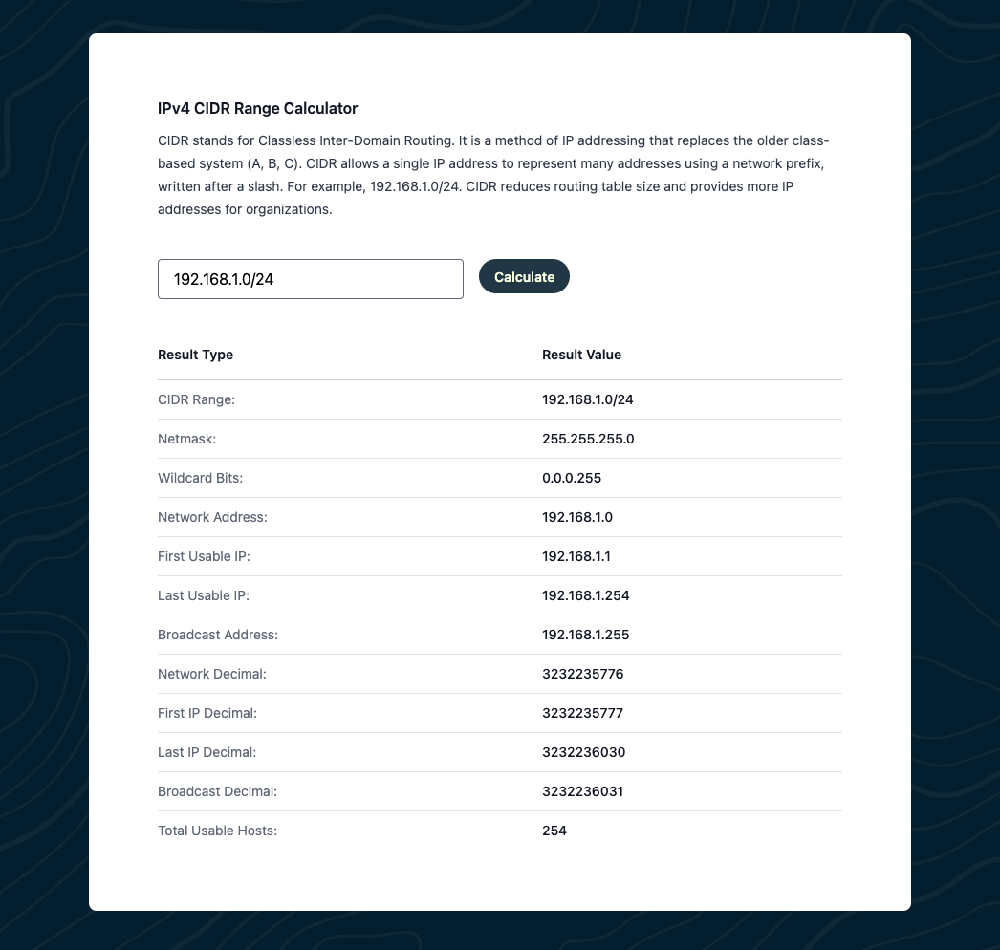

# IPv4 CIDR Range Calculator

A sleek IPv4 CIDR range calculator. CIDR (Classless Inter-Domain Routing) is a method for allocating IP addresses and routing efficiently. With this tool, you can easily input a CIDR address (e.g., `192.168.1.0/24`) and instantly receive key outputs.



---

## Features

- Input any IPv4 CIDR address to calculate:
  - **Netmask**
  - **Wildcard Bits**
  - **Network and Broadcast Address**
  - **First and Last Usable IPs**
  - **Decimal Representations**
  - **Total Usable Hosts**
- Simple UI with clean, responsive design.

---

## Running Locally or Customizing

1. Clone the repository:

   ```bash
   git clone https://github.com/maverickg59/ipv4-cidr-calculator.git
   cd ipv4-cidr-calculator
   ```

2. Install dependencies:

   ```bash
   npm install
   ```

3. Run the development server:

   ```bash
   npm run dev
   ```

4. Open the tool in your browser at:
   ```
   http://localhost:5173
   ```

---

## Usage

1. Enter an IPv4 CIDR address in the input field (e.g., `192.168.1.0/24`).
2. Click the **Calculate** button.
3. View the detailed results in the table below.

---

## Demo

Check out the live version here: [IPv4 CIDR Range Calculator](https://cidrcalc.chriswhite.rocks)

---

## License

MIT License

Copyright (c) 2024 Chris White

---

## Contributing

Contributions are welcome! Please fork the repository and create a pull request with your enhancements or bug fixes.

- Built with ❤️ by [Chris White](https://chriswhite.rocks).

---
